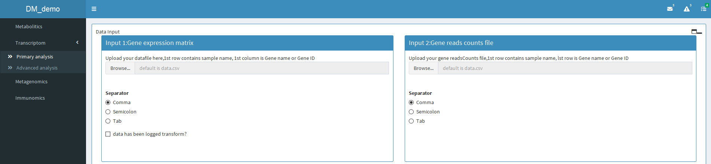
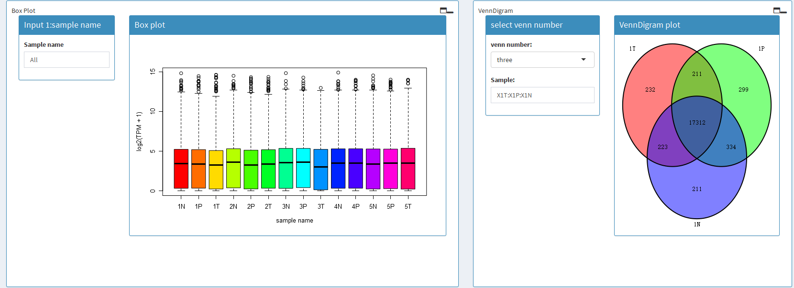
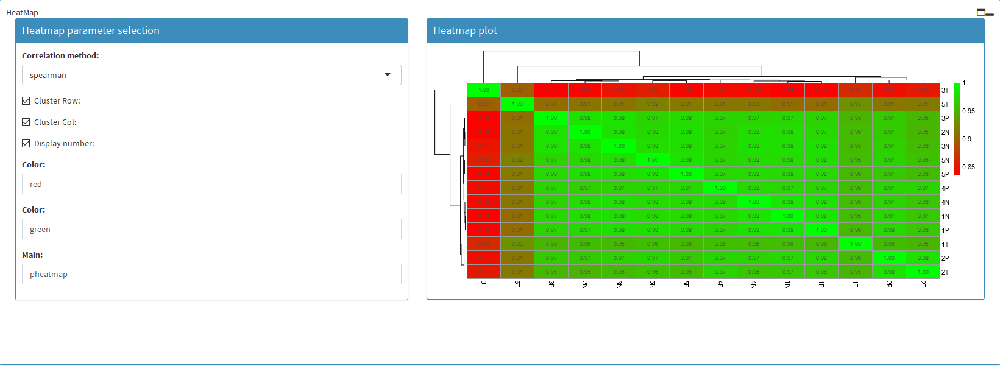
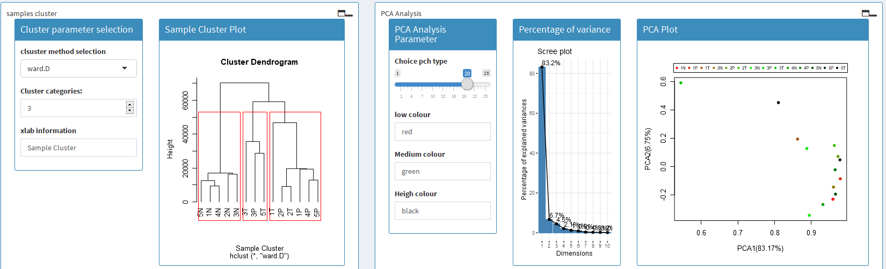
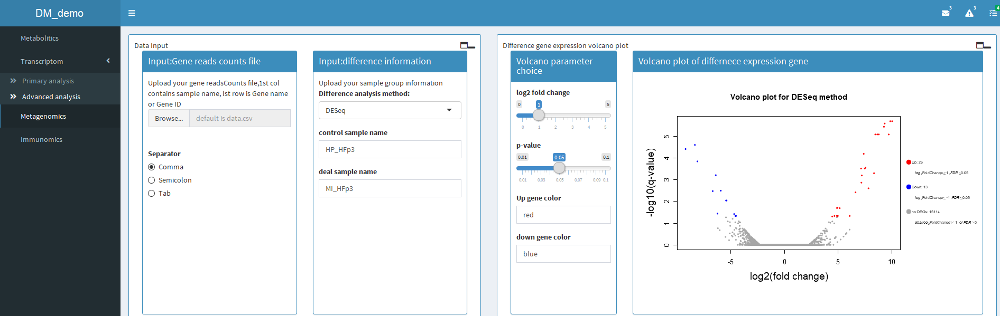
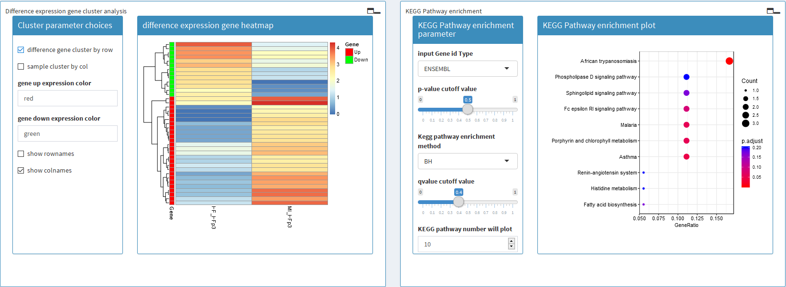
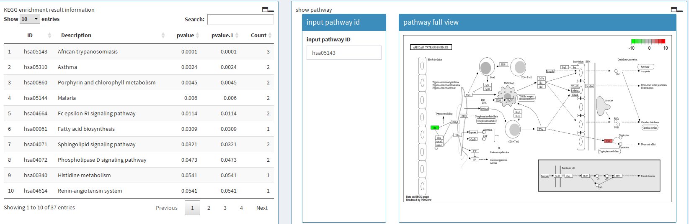
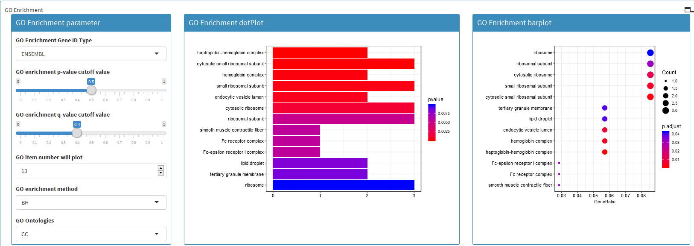
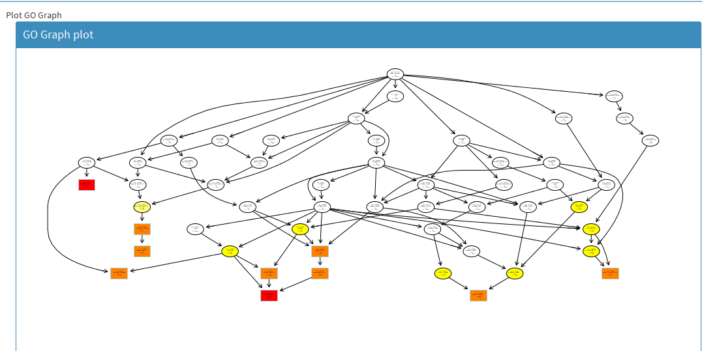

# RNA数据挖掘平台DEMO简介

该平台利用R语言shiny包进行前期开发DEMO模板，提供后期IT开发所需模板。

   样本经过RNA-seq测序，再经过hisat2比对、stringtie的注释，得到基因表达的矩阵和基因readscounts的矩阵，利用这两个矩阵可以进行一些描述性统计，比如

基因在样本表达范围的箱线图、样本之间共表达基因的Venn图、样本之间聚类、PCA分析等基本描述性分析。也可以进行样本之间、组与组之间差异性分析。然后对差异性结

果可以做差异性显著检验、GO富集、KEGG富集等分析，再对每一步结果进行可视化呈现，可视化呈现的过程中可以通过调节可视化参数实现可视化结果实时可变。

## 输入数据节目

可以通过本地上传数据，并且满足数据的格式要求即可。

## 基本描述性统计

1、基因在样本中表达范围和样本之间共表达基因统计

2、样本之间相关性热图

3、样本之间聚类、PCA结果图形呈现及实现图形呈现过程参数可调

## 高级分析

1、样本间、组与组间差异分析

可以通过本地上传数据，并且满足数据格式要求即可

做样本之间差异分析的时候可以选择对照组、处理组，可以根据自己需求随意设置对照组与处理组样本

另外组与组之间差异可以选择不同差异性分析方法，比如DESeq2等。筛选出显著性差异基因后可以火山图

2、显著性差异基因的聚类、KEGG富集分析

3、显著差异性基因GO富集分析

