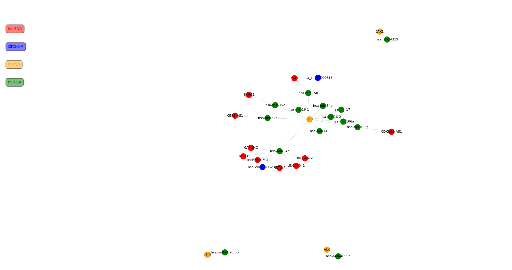

# RNA类相互作用网络背景简介

RNA类相互作用与竞争性内源RNA(CeRNA)假说有关，其竞争性内源RNA的核心内容是：具有相同miRNA应答元件(MRE)的mRNA、假基因转录物、长链非编码RNA、环状非编码

RNA等转录物通过竞争性结合同种miRNA来调控各自的表达水平，从而影响细胞的功能。该假说向我们展现了多种RNA在转录后水平相互影响的机制，体现了全新的宽范围转录

组调

控网络，为我们认识纷繁多样的细胞功能提供了新思路。

RNA类相互作用主要包括如下三种作用形式：

1、miRNA-RNA相互调控关系
  
  miRNA： 是一类21--23nt的小RNA，其前体大概是70~100nt左右，形成标准的stem结构，加工后成为21--23nt的单链RNA。
  
  microRNA的作用机制是与mRNA完全或不完全互补配对，导致靶mRNA降解或抑制其翻译。从而影响蛋白质基因的表达。每种miRNA有上百个靶基因，他们作为转录后调控
  
  因子在基因调控网络中发挥重要作用，调控发育、分化、增值、免疫和新陈代谢等生命活动。
  
2、miRNA-lncRNA的相互调控关系

长链非编码RNA（long non-coding RNA，lncRNA）是对应短片段非编码RNA(miRNA, piRNA, snoRNA, shRNA, etc.)的一个较大的集合概念，是较高级真核生物

细胞转录组中长度超过200nt，且不编码蛋白翻译的线性RNA，包括pseudogene和long intergenic non-coding RNA(lincRNA)等.lncRNA因其存在Introns等片段组

成，长度可达数千nt，这就为吸附结合大量的miRNA提供了良好的物质基础，通过竞争占有胞内大量的miRNA，像海绵一样缓冲并削减其干涉靶基因mRNA编码蛋白的能力，我

们就称这样的lncRNA与mRNA互为ceRNA关系，因此可见，作为关联节点的就是miRNA，它的靶构成了ceRNA，共同组合就是ceRNA网络。

3、miRNA-circRNA的相互调控关系
  
环状 RNA：circRNA分子呈封闭环状结构，不具有5'帽子和3'尾巴结构。不受RNA外切酶影响，表达更稳定，不易降解。但已有研究表明，人类的环状RNA主要是由外显子的

反向剪接产生的。同时，circRNA分子富含microRNA结合位点，在细胞中起到microRNA海绵（microRNAsponge）的作用，进而解除miRNA对其靶基因的抑制作用，升高

靶基因的表达水平。这一作用机制被称为竞争性内源RNA机制。

# RNA类相互作用网络实现

根据竞争性内源RNA的原理，可以看出miRNA是mRNA、lncRNA、circRNA三者之间链接点，那么只要找到miRNA-mRNA调控关系的数据、miRNA-lncRNA调控关系数据和

miRNA-circRNA调控关系的数据，即可通过miRNA把mRNA、lncRNA、circRNA构建一个相互调控网络图出来。

## 数据库收集

[miRTarBase](http://mirtarbase.mbc.nctu.edu.tw/)

该数据库主要收集的是被实验验证的miRNA靶标，同时提供支持搜索结果的文献或方法，最新更新于2015年9月。该数据库支持浏览、搜索和数据下载。

[miRBase](http://www.mirbase.org/)

miRBase数据库是一个提供包括已发表的miRNA序列数据、注释、预测基因靶标等信息的全方位数据库，是存储miRNA信息最主要的公共数据库之一。该数据库于2014年6

月更新为最新版本V21.0，包含223个物种的35828个成熟的miRNA序列。该数据库提供便捷的网上查询服务，允许用户使用关键词或序列在线搜索已知的miRNA和靶标信

息（仅包含已有的靶标信息，所以会出现部分miRNA靶标信息无的现象）。该数据库用于miRNA信息查询较多，靶关系预测较少。

[circBank](http://www.circbank.cn/)

记录≥140,000人的circRNA，靶标miRNA分析，编码能力分析，保守性及RNA修饰

[CircNet](http://circnet.mbc.nctu.edu.tw/)

台湾国立交通大学的研究人员对464个样本的RNA-seq数据系统地整理挖掘后建立的数据库，它提供了新circRNAs的鉴定；整合circRNA-miRNA-mRNA的互作网
络；circRNA亚型的表达水平；circRNA亚型的基因组注释；circRNA亚型的序列

[LNCipedia ](https://lncipedia.org/)

LNCipedia 数据库: 该数据库整合了多个人类（Human）lncRNA数据库信息，很大程度上解决了lncRNA数据库各自为政的问题。自2012年发表至今，该数据库现已更

新到4.1版本，更新时间为2017年5月4日。目前LNCipedia共收录146,742个人类注释lncRNA转录本，这些转录本均包含序列、基因组位置、源自数据库等注释信息.

[Starbase](http://starbase.sysu.edu.cn/)

Starbase 数据库：Starbase V3.0提供miRNA调控LncRNA、假基因和circRNA的互作信息。

[DIANA-LncBase](http://carolina.imis.athena-innovation.gr/index.php?r=lncbasev2)

实验验证的和计算预测的长链非编码RNA上的microRNA靶点

# RNA类相互作用网络图形化结果展示

用python语言实现RNA类相互作用网络图，该[程序](https://github.com/yonglpy/data-analysis/edit/master/RNA%E7%B1%BB%E7%9B%B8%E4%BA%92%E4%BD%9C%E7%94%A8%E7%BD%91%E7%BB%9C/RNA_network.py)可以根据输入mRNA的symbol的ID找到与之有调控关系的miRNA,然后再遍历miRNA,找到与miRNA有调控
关系的lncRNA和circRNA。当然也可以同时输入lncRNA、circRNA、miRNA和mRNA相应的ID，也可以输入他们之间任意ID，即可实现相互作用网络图。

结果如下图：

图片中不同RNA类用不同颜色表示
