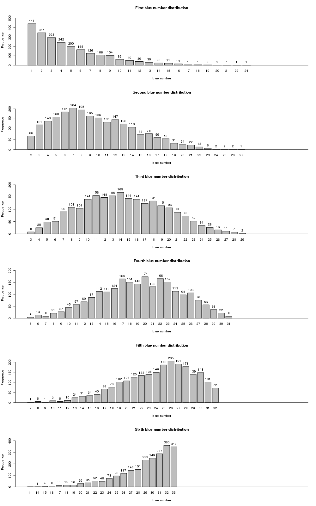

# 历年双色球开奖号码数据探索性分析

red_green_number_sort.txt是记录历年双色球中奖号码信息。

stat.py是统计历年每期开奖号码出现频率的python程序。

## 中奖号码分布分析
1、统计分析历年每期开奖号码出现频率，分别统计6个红色球与1个红色球，然后绘制柱状图，结果如下

6个红色球频率分布：

1个蓝色球频率分布：

从中奖号码分布频率来看，每个数字（红色球1-33，蓝色球1-16)出现频率相差不大，也就是每个数字是中奖号码概率基本均等，与开奖规则基本保持一致。

2、分布对红色球1-6号位置的历年中奖号码统计出现频率，绘制柱状图如下：

从图上可以看出，红球1号位出现次数最多数字是1，出现次数最少是21、22、24这三个数字，分布呈现随着数字增大，出现频率逐渐降低。

红球2号位出现次数最多数字是7，出现次数最少的是28，分布形状趋向于正太分布，随着数字增大，频率先逐渐增加后又逐渐降低。

红球3号位出现次数最多数字是14，出现次数最少的是29，分布形状更接近正太分布，随着数字增大，频率先逐渐增加后又逐渐降低。

红球4号位出现次数最多数字是20，出现次数最少的是5，分布形状基本上符合正太分布，随着数字增大，频率先逐渐增加后又逐渐降低。

红球5号位出现次数最多数字是26，出现次数最少的是7、9这两个数字，分布形状趋向于正太分布，与红球2号位分布相反形状，随着数字增大，频率先逐渐增加后又逐渐降低。

红球6号位出现次数最多数字是32，出现次数最少的是11、14这两个数字，分布呈现随着数字增大，出现频率逐渐增加。

从以上分析可以得到，红球1号位主要集中在1-10之间，二号位主要集中在3-14之间，三号位主要集中在8-20之间，四号位主要集中14-26之间，五号位主要集中在19-31之间，六号位主要集中在26-33之间。依此可能会对以后购买双色球有所指导，尽量避免选择1-6号红球出现频率低的数字作为候选中奖号码，另外这只是从数据角度出发，与实际结果可能有所出入，请谨慎借鉴！
