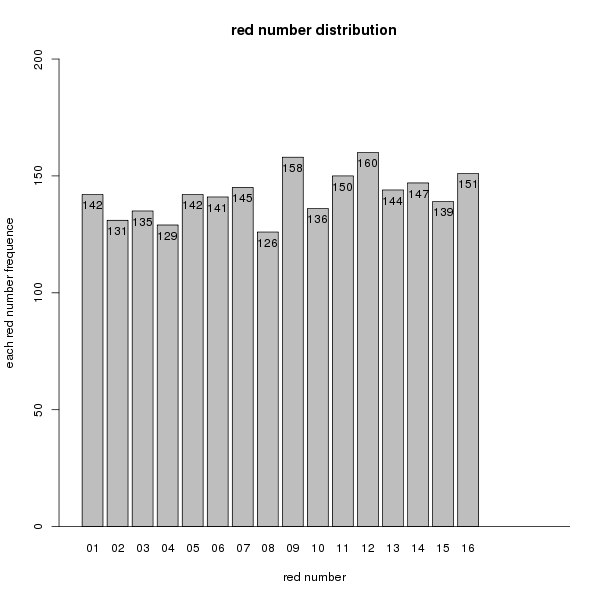
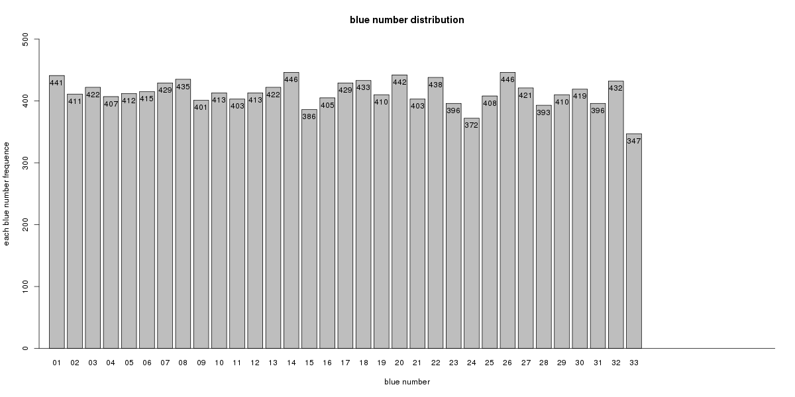

# 历年双色球开奖号码数据探索性分析

red_green_number_sort.txt是记录历年双色球中奖号码信息

## 中奖号码分布分析
统计分析历年每期开奖号码出现频率，分别统计6个红色球与1个红色球，然后绘制柱状图，结果如下

6个红色球频率分布：

1个蓝色球频率分布：

从中奖号码分布频率来看，每个数字（红色球1-33，蓝色球1-16)出现频率相差大，也就是每个数字是中奖号码概率基本均等，与开奖规则基本保持一致。
