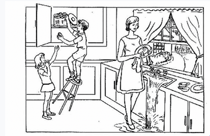

# AI开发者大赛-阿尔茨海默综合征预测挑战赛

## 项目背景简介

为研究如何自动筛查出阿兹海默氏症患者，我们建立了一个普通话痴呆症检测数据库，记录了超过500个老年人参加看图说话任务的音频和文本。

看图说话任务取自波士顿失语症诊断测试 (Diagnostic Aphasia Examination) [1]。任务要求主试者先向被试展示这幅图片然后说“告诉我你在这幅图里看到的正在发

生的一切 ”。允许主试在被试无法说出很多内容的时候鼓励被试。每个音频文件都先被采集然后人工转出文本。音频中出现不属于看图说话任务的对话没有被转写。

看图说话任务图片是：

被试按医学诊断分为三类：

•	CTRL：健康

•	MCI：轻度认知障碍

•	AD：可能是阿兹海默氏症或其他种类的痴呆症

比赛任务数据为看图说话的音频和对应文本。去除录音效果差，方言过多和测试中断等问题数据后，为了与国际研究匹配，又丢弃了小于40岁和受教育程度小于5年的样本。

最终数据库中CTRL人数138，MCI人数179，AD人数84。

## 模型训练

首先，查看了每个特征的数据分布情况，发现特征的取值范围相差比较大，所以再数据训练之前对数据集做了标准化处理。然后再应用特征递归消除法，确定特征对预测结果

重要程度。再应用逻辑回归算法、决策树算法、随机森林算法、支持向量机算法和KNN算法分别选择适量的特征数量进行模型训练，筛选单个算法在验证数据集中准确率最高

的特征数量。结果显示单个算法预测准确率最高为81%。在做这个项目过程中受到随机森林算法启示，再结合投票决定结果策略，确定了最终模型训练方案，就是应用5中分类

算法的预测结果，采用投票决定的方法确定最终预测结果。最终模型在测试数据集上预测准确性达到92%

## 程序说明

[模型训练](./AD_Classifier.py)

[决策树模型](./AD_DTC.model)

[KNN模型](./AD_KNN.model)

[逻辑回归模型](./AD_LR.model)

[随机森林模型](./AD_RF.model)

[支持向量机模型](./AD_SVM.model)

[预测结果产生](./prediction_AD.py)

